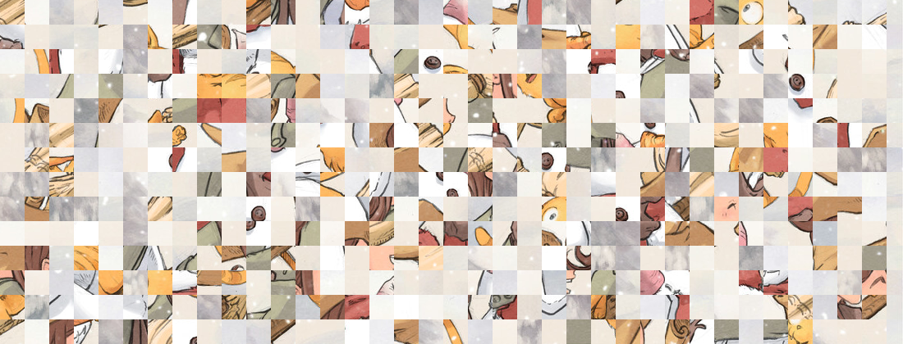

# Pycasso

Image obfuscation tool with seed.

## Example

### Scramble

Using scramble mode on `export` on [this sample image](./examples/en_Pepper-and-Carrot_by-David-Revoy_E05P01_p2.png) will produce the following output:



### Unscramble

To revert the image to its original state, use the same `seed` and `slice_size` on unscramble mode:

```python
img = 'examples/en_Pepper-and-Carrot_by-David-Revoy_E05P01_p2_pycasso.png'
slice_size = (30, 30)
seed = 'Pycasso'
```


## Credits

* Pycasso is a Python version of [webcaetano/image-scramble](https://github.com/webcaetano/image-scramble) and [webcaetano/shuffle-seed](https://github.com/webcaetano/shuffle-seed). This also uses a stripped-down port of [davidbau/seedrandom](https://github.com/davidbau/seedrandom). Hence, this module now replicates the same output as the original JS module, in contrast with the first release where the random module from the Python standard library was used to initialize the PRNG.

* Sample image is taken from [Pepper & Carrot](https://peppercarrot.com/) by David Revoy licensed under [CC BY 4.0](https://www.peppercarrot.com/en/license/index.html).

## Getting Started

### Prerequisites
* Python 3.8+

### Setup

#### Install from PyPI

```bash
$ pip install image-scramble
```

#### Install from source

*  First, you should get a copy of this project in your local machine by either downloading the zip file or cloning the repository. `git clone https://github.com/catsital/pycasso.git`
* `cd` into `pycasso` directory.
* Run `python setup.py install` to install package.

## Usage

### Using the command-line utility

After installing, you can get started by using the command-line utility to scramble or unscramble an image by:

```bash
$ pycasso image_input.png image_output scramble
```
This will produce a scrambled image with seed based on your current system time. Hence, the output will be completely unpredictable and irreversible. Use the options `-n` for `slice_width` and `slice_height` and `-s` for `seed` to fine-tune your desired output, like so:

```bash
$ pycasso image_input.png image_output scramble -n 50 30 -s seed -f jpeg
```

### Using in a script

Initialize a `Canvas` and use scramble on `export` by:

```python
from pycasso import Canvas
img = 'image_input.png'
slice_size = (50, 30)
seed = 'seed'
pycasso = Canvas(img, slice_size, seed)
pycasso.export(mode='scramble', path='image_output', format='png')
```

This can be also achieved in a one-liner:

```python
Canvas('image_input.png', (50, 30), 'seed').export('scramble', 'image_output', 'png')
```

## Params

**img**
* Path to image source

**slice_size**
* Size (width and height) of each slice

**seed**
* Seed to shuffle in same sequence

**output**
* Output file name

**format**
* Image format

## Modes

**scramble** *default*
* Splits and scrambles image into tiles

**unscramble**
* Reverts the image to its original form given the same seed

*Modes can be used interchangeably and conversely perform their original functions. (i.e. If you use unscramble to scramble an image, it will scramble the image. Consequently you should use scramble to unscramble the image to its original form.)*

## License

```
Copyright (c) 2021 Julia Torres
Copyright (c) 2015 Andre Caetano

Permission is hereby granted, free of charge, to any person obtaining a copy
of this software and associated documentation files (the "Software"), to deal
in the Software without restriction, including without limitation the rights
to use, copy, modify, merge, publish, distribute, sublicense, and/or sell
copies of the Software, and to permit persons to whom the Software is
furnished to do so, subject to the following conditions:

The above copyright notice and this permission notice shall be included in all
copies or substantial portions of the Software.

THE SOFTWARE IS PROVIDED "AS IS", WITHOUT WARRANTY OF ANY KIND, EXPRESS OR
IMPLIED, INCLUDING BUT NOT LIMITED TO THE WARRANTIES OF MERCHANTABILITY,
FITNESS FOR A PARTICULAR PURPOSE AND NONINFRINGEMENT. IN NO EVENT SHALL THE
AUTHORS OR COPYRIGHT HOLDERS BE LIABLE FOR ANY CLAIM, DAMAGES OR OTHER
LIABILITY, WHETHER IN AN ACTION OF CONTRACT, TORT OR OTHERWISE, ARISING FROM,
OUT OF OR IN CONNECTION WITH THE SOFTWARE OR THE USE OR OTHER DEALINGS IN THE
SOFTWARE.
```
